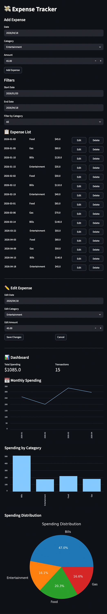

# 💸 Expense Tracker (Streamlit App)

An interactive expense tracking dashboard built with **Python, Streamlit, SQLite, and Pandas**.

## 🚀 Features

- ✅ Add, edit, and delete expenses (CRUD)
- 📅 Filter by date range
- 📊 Category filtering
- 📈 Monthly spending trends
- 📊 Category bar chart
- 🥧 Spending distribution pie chart
- ⚡ Real-time updates

## 🖼️ Preview

## 🛠️ Tech Stack

- Python
- Streamlit
- SQLite
- Pandas
- Matplotlib

## ▶️ Run Locally

 bash
pip install -r requirements.txt
streamlit run app.py